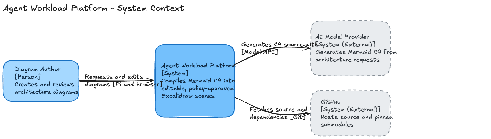

# Agent Workload Platform

This monorepo lets an agent running on a client machine orchestrate workloads
across local tools, capability-limited WebAssembly modules, isolated Gondolin
micro-VMs, browsers, storage systems, and remote model infrastructure.

C4-to-Excalidraw is the first workload, not the scope of the platform.
Its browserless Wasm path is tested with context, container, component,
dynamic, and deployment views. Wassette loads one composed `c4-suite.wasm`;
WAC assembles that suite from immutable, independently reusable components.

The [SQLite-backed Memory Server](workloads/sqlite-persistence/README.md)
reuses Wassette's nine-tool knowledge-graph contract while replacing volatile
arrays with SQLite and one narrowly scoped WASI filesystem capability. The
Gondolin browser extension exposes Playwright and memory together so Pi can
recall earlier research and retain durable browser findings across sessions.
When `GITHUB_TOKEN` is present, it also loads the published GitHub Wassette
component by pinned OCI digest—without rebuilding it.

_C1 system context rendered from the policy-approved Excalidraw scene._

## C4 workload

C4-to-Excalidraw is the first platform workload. Follow the [C4 workload
README](workloads/c4-excalidraw/README.md) for setup, build, verification, and
the real Pi dog-food run, including supported syntax and rendering limits.

The source-controlled architecture views are:

- [C1 system context](workloads/c4-excalidraw/examples/c1-system-context.mmd)
- [C2 container view](workloads/c4-excalidraw/examples/c2-container.mmd)
- [C3 Pi extension components](workloads/c4-excalidraw/examples/c3-pi-extension-components.mmd)

## Layout

- `apps/` — reusable runnable applications, including the pinned `excalidraw-mcp` submodule.
- `workloads/` — independently runnable agent workloads, including `c4-excalidraw`.
- `adapters/` — implementations at external seams:
  - `mermaid-to-excalidraw` — untouched upstream submodule.
  - `c4-gondolin` — platform-owned C4/browser adapter.
- `components/` — reusable WIT/WebAssembly modules.
- `runtimes/` — Pi, Wassette, and Gondolin runtime integration.
  - `gondolin-browser` — Pi extension that exposes the official Playwright MCP
    tools from an isolated VM alongside persistent memory and optional GitHub
    tools in Wassette, without copying their schemas.

Workload-specific contracts, prompts, examples, and modules remain inside the
workload until another workload genuinely reuses them. Shared implementations
then move to `components/`, `adapters/`, `apps/`, or `runtimes/` according to
their responsibility.

There is no repository-specific dispatcher or lifecycle wrapper. A single pnpm
workspace installs and runs every JavaScript package. Upstream lockfiles remain
inside untouched Git submodules for provenance but are not used by the platform
workflow. See the C4 package README for dependency setup. Imported source
provenance is recorded in `PROVENANCE.md`.

## Research

- [Available Wasm components and ecosystem compatibility](docs/research/available-wasm-components-ecosystem.md)
- [WIT and TypeScript component practices](docs/research/wasm-wit-typescript-best-practices.md)
