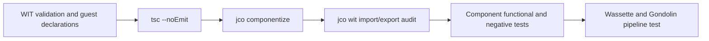

# Wasm Component Model/WIT and TypeScript best practices

Research date: 2026-08-30. This document is detailed background research, not
the primary operational guide. Start with the [project decisions](../decisions/wasm-wit-typescript.md)
for the rules and commands that apply to this repository.

Implementation note: the subsequent browserless migration replaced the
compiler's `browser-layout` import with a typed `graph-layout` import, implemented
by a synchronous Dagre component and statically composed with WAC. References
below to `browser-layout` describe the earlier design and the retained Gondolin
compatibility world.

Sources are limited to the WebAssembly Component Model
specification/documentation and Bytecode Alliance projects (Jco, ComponentizeJS,
and Wasmtime). The research is specifically aimed at porting
`workloads/c4-excalidraw/components/src/*.js` to TypeScript without weakening the
existing WIT boundary.

## Executive recommendations

1. Keep WIT as the source of truth. Generate **guest** declarations from each
   selected world, import those types in the TypeScript implementation, and run
   `tsc --noEmit` separately. Current Jco can accept a `.ts` entry point and
   bundles it with Rolldown, but this only erases TypeScript syntax and does not
   perform semantic type checking. [`jco componentize` TypeScript docs](https://bytecodealliance.github.io/jco/creating-new-js-components.html)
2. Preserve the current small, capability-oriented worlds. A world is the
   complete import/export contract and therefore the component's authority
   boundary; an absent filesystem, network, clock, or secret-store import is a
   meaningful security property. [Component Model worlds](https://component-model.bytecodealliance.org/design/worlds.html)
3. Continue building these deterministic components with all implicit
   ComponentizeJS features disabled. The default engine features can add
   `stdio`, randomness, clocks, HTTP, and fetch-event WASI imports; disabling
   all of them creates a pure component whose only dependencies are the target
   world's explicit imports. Note that a pure component cannot report engine
   errors through stdio and may trap, so tests must exercise failure paths.
   [ComponentizeJS feature controls](https://github.com/bytecodealliance/ComponentizeJS#features)
4. Do not replace the value-shaped `prepared-compilation.state` or
   `layout-snapshot` with resources merely to avoid TypeScript modeling.
   Resources are for identity-bearing, non-copyable entities with a lifetime;
   records and lists are the correct semantics for immutable handoff values.
   [WIT resources](https://component-model.bytecodealliance.org/design/wit.html#resources)
5. Treat strings, lists, and JSON envelopes as boundary-cost centers. The
   Canonical ABI crosses shared-nothing memories by lowering/lifting values;
   dynamically sized strings/lists require memory plus allocation and copying.
   Keep calls coarse-grained, enforce byte/element limits before allocation,
   and avoid repeated JSON encode/decode across the same boundary.
   [Canonical ABI overview](https://github.com/WebAssembly/component-model/blob/main/design/mvp/Explainer.md#canonical-abi),
   [Canonical ABI algorithms](https://github.com/WebAssembly/component-model/blob/main/design/mvp/CanonicalABI.md)

## WIT API design

### Packages, interfaces, and worlds

- Use a versioned package for related contracts, focused interfaces for cohesive
  behavior, and worlds only to assemble the imports and exports needed by one
  component role. WIT packages contain interfaces/worlds; a world is a bundle
  of directional imports and exports, not a package. [WIT packages](https://component-model.bytecodealliance.org/design/packages.html),
  [WIT reference](https://component-model.bytecodealliance.org/design/wit.html)
- Keep reusable named records, variants, enums, and resources in an interface
  and bring them into behavioral interfaces with `use`. Named external types
  are important because generated bindings in nominally typed languages need a
  stable name. [External visibility of types](https://github.com/WebAssembly/component-model/blob/main/design/mvp/Explainer.md#external-visibility-of-types)
- Add `///` documentation to public interfaces, functions, fields, units,
  invariants, size limits, ownership, and error conditions. WIT preserves
  documentation comments for the following item. [WIT documentation syntax](https://component-model.bytecodealliance.org/design/wit.html#documentation)
- Prefer one coarse operation over chatty getters/setters when all data is
  needed together. This is both a deep-interface design choice and a Canonical
  ABI optimization: fewer calls mean fewer lifts, lowers, allocations, and
  copies.

The repository's `compiler` interface follows these rules well: `compile`
hides parsing, layout delegation, validation, and scene construction. The
`compiler-core` prepare/finish world is appropriately documented as a host
compatibility seam rather than the preferred public API.

### Value types, resources, and errors

- Use records for product data, variants for tagged alternatives with distinct
  payloads, enums for payload-free closed choices, options for absence, and
  `result<T, E>` for expected domain failure. These constructs have idiomatic
  cross-language mappings. [WIT values and results](https://component-model.bytecodealliance.org/design/wit.html#built-in-types)
- Use a resource only when callers need a handle to state or an external entity
  that should not be copied. Be explicit about `own<T>` transfer versus
  `borrow<T>` for call-scoped access; dropping an owned handle destroys the
  resource. [WIT resource ownership](https://component-model.bytecodealliance.org/design/wit.html#resources)
- Keep expected validation/policy failures in `result`, reserving traps or JS
  programming exceptions for violated invariants and bugs. For Jco's JS
  mapping, a **top-level function result** is surfaced as a JS exception, while
  nested results use `{ tag: 'ok' | 'err', val }`; an idiomatic `Error` may carry
  the typed WIT value in `.payload`. Generated guest declarations should
  therefore decide the implementation shape instead of handwritten guesses.
  [Jco result representation](https://bytecodealliance.github.io/jco/wit-type-representations.html#result-result)
- Keep error codes machine-readable and messages diagnostic. Avoid branching on
  message strings. Because the current Component Model only relaxes subtyping
  for component and instance types—not arbitrary records/enums/variants—assume
  value-shape changes require a versioned compatibility review and regenerated
  bindings. [Component type checking](https://github.com/WebAssembly/component-model/blob/main/design/mvp/Explainer.md#type-checking)

For this repository, `pipeline-error { code, message, details }` is a sound
boundary type. During the TypeScript port, verify with generated guest types
whether an exported failure must be thrown as that payload rather than returned
as a tagged object.

## Canonical ABI and boundary cost

The Canonical ABI maps component values to core Wasm calls across a
shared-nothing boundary. Scalars may flatten directly, while strings and lists
use pointer/length representations in linear memory and can require `realloc`;
returned allocations may require `post-return` cleanup. UTF-8 is the default
string encoding, while JS-oriented embeddings may choose the compact
Latin-1/UTF-16 representation. [Canonical ABI definitions](https://github.com/WebAssembly/component-model/blob/main/design/mvp/Explainer.md#canonical-definitions)

Practical rules:

- Pass `list<u8>` for opaque binary data (`Uint8Array` in Jco), not
  `list<u32>` or encoded text. Use `string` for Unicode text, not `list<char>`;
  the latter uses four-byte code points in the Canonical ABI.
  [Component Model value representation](https://github.com/WebAssembly/component-model/blob/main/design/mvp/Explainer.md#value-definitions)
- Bound every caller-controlled string/list before expensive parsing or further
  expansion. Keep the existing `maximum-source-bytes`, `maximum-output-bytes`,
  `maximum-elements`, and policy-side scene limits, and test them at the exact
  boundary and one unit beyond.
- Avoid per-node boundary calls and repeated whole-scene serialization. One
  typed `layout-snapshot` transfer is preferable to a call per node/edge. The
  existing JSON scene envelope is a reasonable deliberate compatibility escape
  hatch, but its schema/version and maximum encoded bytes must remain validated.
- Benchmark realistic large diagrams if the envelope grows; changing JS to TS
  does not remove Canonical ABI allocation/copy cost.

## Capability security

WIT worlds provide capability security by making every external dependency an
explicit import. A component can only call imports supplied by its host or by
composition. [World imports as the sandbox boundary](https://component-model.bytecodealliance.org/design/worlds.html)

- Keep `c4-compiler-core` and `excalidraw-policy-component` import-free and use
  `--disable all`; keep the eventual `c4-compiler` limited to the single
  `browser-layout` capability.
- Audit the built component's WIT after every build. Source review alone is
  insufficient because ComponentizeJS engine features can introduce WASI
  imports.
- If a Jco Preview 2 shim is later used as a host, configure its sandbox
  explicitly. Its default Node-oriented behavior grants full host filesystem,
  environment, and network access; `WASIShim({ sandbox: ... })` can deny or
  selectively preopen them. [Jco Preview 2 shim sandboxing](https://github.com/bytecodealliance/jco/blob/main/packages/preview2-shim/README.md#sandboxing)
- Keep untrusted-data limits and semantic checks inside the Wasm component even
  when the host/VM also validates. Capability restriction controls authority;
  it does not by itself prevent CPU or memory exhaustion from oversized valid
  inputs.

## Versioning

- Keep the package version in the WIT package ID and pin toolchain/WIT
  dependencies in the lockfile. WIT package IDs accept SemVer versions.
  [WIT package versions](https://component-model.bytecodealliance.org/design/wit.html#packages)
- Follow SemVer intent and test actual structural compatibility. Canonical
  interface names group compatible versions as `1` for `1.x`, `0.2` for
  `0.2.x`, and an exact `0.0.z` prefix for early versions, but linking still
  requires component type compatibility. [Canonical interface version matching](https://github.com/WebAssembly/component-model/blob/main/design/mvp/Explainer.md#canonical-interface-name)
- Use WIT `@since` for additive versioned items, `@unstable(feature = ...)` for
  opt-in experimental surface, and `@deprecated` for retirement. Once an item
  has `@since`, the WIT specification requires its definition to remain
  unchanged across subsequent versions where it is present.
  [WIT feature gates](https://github.com/WebAssembly/component-model/blob/main/design/mvp/WIT.md#feature-gates)
- For the current `0.1.0` package, treat changed parameter/result shapes,
  renamed fields/cases, or altered semantics as a WIT release. Regenerate
  declarations and run consumer/host tests for every WIT change; do not rely on
  TypeScript structural compatibility as proof of component compatibility.
- Preserve the inner `scene-envelope.format-version` because it versions the
  intentionally opaque Excalidraw JSON independently of the outer WIT package.

## Async status and limitations

Do not add WIT async solely because an implementation function is declared
`async` in TypeScript.

- ComponentizeJS currently permits exported JS functions to return promises,
  but resolves them internally and exposes a **synchronous component function**.
  Imported functions remain synchronous in this mode. [ComponentizeJS async support](https://github.com/bytecodealliance/ComponentizeJS#async-support)
- The Component Model now specifies native `async func`, `future<T>`, and
  `stream<T>` as part of the concurrency work, and WASI 0.3 uses streams and
  futures. These are distinct ABI features, not equivalent to ComponentizeJS
  promise syncification. [WIT streams and futures](https://component-model.bytecodealliance.org/design/wit.html#streams),
  [Component Model concurrency explainer](https://github.com/WebAssembly/component-model/blob/main/design/mvp/Concurrency.md)
- Jco's JSPI async import/export transpilation flags are explicitly
  experimental. Do not make the C4 pipeline depend on them until the chosen Jco,
  componentizer, host runtime, and deployment engine pass an end-to-end
  compatibility test. [Jco experimental async options](https://bytecodealliance.github.io/jco/transpiling.html#options)

The current prepare/render/finish orchestration should therefore remain
synchronous at the WIT boundary. Browser work can stay asynchronous in the host
between `prepare` and `finish` without changing either component export.

## TypeScript binding and build recommendations

### Binding workflow

1. Select a world explicitly with `--world-name`; this repository has multiple
   worlds in one package.
2. Generate guest-side declarations with `jco guest-types <wit-dir>
   --world-name <world> -o <generated-dir>`. Use `jco types` for host/transpiled
   bindings, not as a substitute for guest implementation declarations. Jco's
   WIT mapping converts kebab-case names to idiomatic camelCase, records to
   objects, options to `T | undefined`, `list<u8>` to `Uint8Array`, other lists
   to arrays, and 64-bit integers to `bigint`. [Jco WIT type representations](https://bytecodealliance.github.io/jco/wit-type-representations.html)
3. Include generated declarations in `tsconfig.json`, type the exported
   interface object/functions from those declarations, and make the compiler
   implementation strict (`strict`, `noUncheckedIndexedAccess`, and
   `exactOptionalPropertyTypes` where the generated declaration style permits).
4. Run `tsc --noEmit` before `jco componentize`. Modern Jco can componentize a
   TypeScript entry directly and auto-bundles local/package imports, but it only
   strips types. [Jco TypeScript componentization](https://bytecodealliance.github.io/jco/creating-new-js-components.html#bundling)

### Repository/toolchain note

The component package currently declares Jco `1.17.0` and ComponentizeJS
`0.19.3`; the installed CLI observed during this research reports Jco `1.16.1`.
The current official TypeScript-entry documentation describes newer Jco
behavior. Before changing build entries from `.js` to `.ts`, either:

- upgrade and pin Jco/ComponentizeJS together, regenerate the lockfile, and
  validate generated bindings and runtime behavior; or
- keep the pinned componentizer and compile/bundle checked TypeScript to ESM
  JavaScript first, then componentize that JS artifact.

This deserves an explicit compatibility test. Jco documents that
ComponentizeJS `0.19.3` may be selected for old pre-`0.2.10` WASI dependencies
and that it lacks a crash fix present in `0.20.0`; avoid an accidental fallback
if WASI dependencies are added later. [Jco ComponentizeJS compatibility note](https://bytecodealliance.github.io/jco/troubleshooting/common-issues.html#componentize-js-0193-fallback)

## Build and test gates

Use one reproducible command chain per world:

Recommended CI assertions:

- pin local Node.js tools and use the lockfile; do not depend on a global Jco;
- run `wasm-tools validate` on each emitted component;
- fail if generated guest declarations differ after a WIT change;
- fail if `jco wit` reveals an import not allowlisted for that world;
- test success plus every `pipeline-error.code`, malformed JSON, non-finite
  geometry, duplicate/missing IDs, exact size limits, and excessive elements;
- verify TS and JS/Wasm implementations produce identical approved scene data
  for fixed fixtures during the migration;
- run each emitted component in the actual host/runtime, not only as plain
  TypeScript, because componentization and Canonical ABI error mapping are part
  of the contract;
- retain the deterministic adapter unit tests and run the end-to-end isolated
  browser path as a separate integration test.

Jco's documented end-to-end workflow uses `componentize`, `jco wit` to inspect
the binary contract, `transpile`, and execution of the generated module; this is
a useful minimum smoke-test pattern in addition to the production-host test.
[Jco example workflow](https://bytecodealliance.github.io/jco/example.html)
[wasm-tools command examples](https://github.com/bytecodealliance/wasm-tools#examples)

## Suggested migration sequence

1. Freeze the current WIT and representative JS behavior fixtures.
2. Resolve the Jco/ComponentizeJS version strategy above.
3. Generate guest declarations for `c4-compiler-core` and
   `excalidraw-policy-component`.
4. Port shared pure helpers first, then each exported interface, using generated
   types and explicit WIT-to-JS naming.
5. Add the typecheck gate, build both `.wasm` components with `--disable all`,
   and audit their extracted WIT.
6. Run differential fixture tests followed by the full isolated pipeline.
7. Only after parity, remove the old JS entries and make TypeScript the sole
   source.
