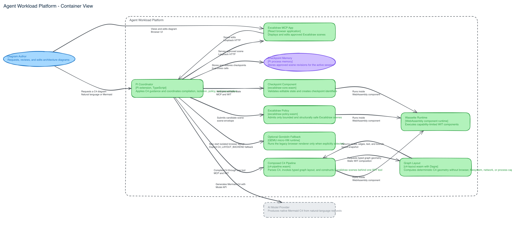
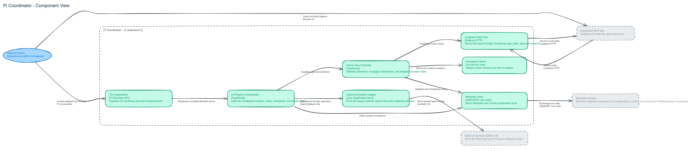

# C4 to Excalidraw workload

This workload turns native Mermaid C4 source into an editable, policy-approved
Excalidraw scene. Pi coordinates the workflow, Wassette runs the WebAssembly
components, and Gondolin isolates the browser-only layout step in a QEMU
micro-VM.

## Architecture

### C1 system context


Source: [C1 system context](examples/c1-system-context.mmd)

### C2 container view



Source: [C2 container view](examples/c2-container.mmd)

Responsibilities are separated as follows:

- `pi-extension.ts` coordinates Wassette, Gondolin, and the loopback-only web
  application.
- `components/` builds the capability-limited C4 compiler and Excalidraw policy
  components.
- `core/` builds the checkpoint component used by the Excalidraw application.
- `contracts/c4-pipeline/` contains the WIT interfaces shared across boundaries.
- `../../adapters/c4-gondolin/` owns C4 preprocessing and isolated browser
  layout.
- `../../adapters/mermaid-to-excalidraw/` and `../../apps/excalidraw-mcp/` are
  unchanged upstream submodules.

### C3 Pi extension components



Source: [C3 Pi extension components](examples/c3-pi-extension-components.mmd)

Only a typed `layout-snapshot` leaves the browser worker. Scene construction
stays inside `c4-compiler.wasm`, and only a scene accepted by
`excalidraw-policy.wasm` reaches the application.

## Setup

From the repository root:

```bash
git submodule update --init --recursive
command -v corepack >/dev/null && corepack enable || npm install --global pnpm@11.19.0
pnpm install --frozen-lockfile --ignore-scripts
make c4-build
make c4-gondolin-build
```

The repository invokes only pnpm. The upstream submodules retain their own
lockfiles unchanged, but the root `pnpm-lock.yaml` controls platform builds.

The Wasm guests use WIT as their source of truth. Their builds regenerate Jco
guest declarations, type-check the TypeScript, compile it to an ignored ESM
intermediate, and componentize the JavaScript. See
[`Wasm, WIT, and TypeScript best practices`](../../docs/research/wasm-wit-typescript-best-practices.md).

## Run

To let Pi create and render a diagram interactively:

```bash
pi \
  --skill ~/.codex/skills/c4-diagrams \
  --extension ./workloads/c4-excalidraw/pi-extension.ts
```

Ask Pi to create one C4 view and render it in Excalidraw. The extension exposes
`excalidraw_c4_render`, which accepts the complete native Mermaid source.

To run an existing Mermaid file non-interactively:

```bash
make c4 \
  C4_INPUT=workloads/c4-excalidraw/examples/composable-c4-pipeline.mmd \
  C4_OUTPUT=artifacts/c4-excalidraw/composable-c4-pipeline.excalidraw
```

`C4_MODEL` selects the Pi model. It defaults to
`openai-codex/gpt-5.6-terra`. The model dispatches the attached source to the
tool; the compiler and policy components produce the output.

## Verify

```bash
make c4-test
```

This validates the WIT contracts, rebuilds and loads the components, exercises
the Wassette checkpoint round trip, tests the Gondolin adapter, and runs the
selected upstream converter tests. It does not rebuild the Gondolin guest assets;
run `make c4-gondolin-build` for that architecture-specific Docker and QEMU
artifact build before running the real dog-food command.

## Contracts and supported syntax

The [C4 pipeline contract](contracts/c4-pipeline/README.md) defines the target
single-call compiler world, the current two-phase Wassette compatibility world,
and the independent admission-policy world.

Supported Mermaid document types are `C4Context`, `C4Container`,
`C4Component`, `C4Dynamic`, and `C4Deployment`, including deployment nodes and
boundaries supported by the pinned Mermaid renderer.

The Excalidraw React application remains browser code; it is not compiled to
WebAssembly. Wassette constrains the compiler and policy components, while
Gondolin contains Chromium and its Node adapter.
