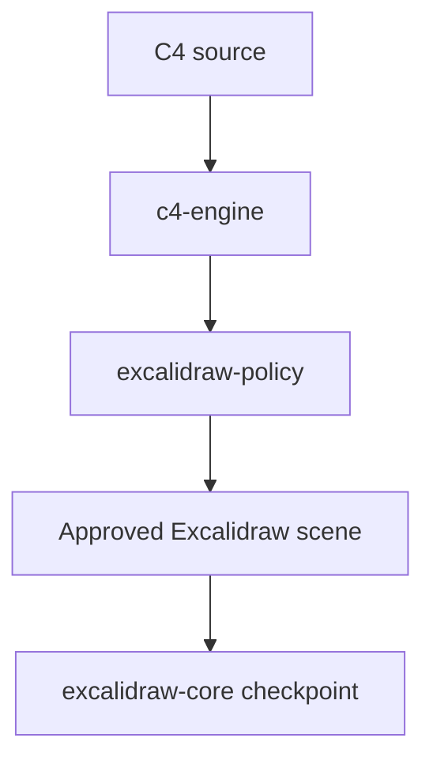

# Composable C4 pipeline contract

This WIT package exposes the C4 engine and reusable scene-policy module:



The external compiler interface deliberately has one operation: `compile`.
Parsing, Dagre layout, layout validation, and Excalidraw construction are
internal TypeScript modules hidden behind that interface.

## Worlds

- `c4-engine` exports the single-call `compiler` interface. Compiler and layout
  share one StarlingMonkey runtime because neither is independently reused.
- `c4-compiler-core` retains `prepare` and `finish` only for the explicit
  Gondolin/Playwright compatibility path.
- `excalidraw-policy-component` validates compiler output independently. It
  remains a separate world so compiler and security-policy implementations can
  evolve or be replaced independently.

WAC packages `c4-engine`, `excalidraw-policy`, and the independently reusable
`prototype:excalidraw-core` checkpoint module into `c4-suite.wasm` without
recompiling any block. The checkpoint contract is owned by `core/`; this WIT
package owns only the compiler and policy contracts.

## Invariants

- `prepared-compilation.state` is opaque and must be returned to `finish`
  without modification.
- A layout snapshot may contain only finite coordinates within the compiler's
  configured limits.
- Node and edge identifiers must refer to entities in the prepared compiler
  state.
- `scene-envelope.format` is `excalidraw`; `format-version` currently equals
  `2`.
- Only a scene returned by `excalidraw-policy.approve` may reach the browser or
  the checkpoint store.
- The suite has no filesystem, network, clock, process, or browser imports. Its
  checkpoint block imports WASI randomness only to create checkpoint IDs.
- The optional Gondolin adapter remains outside the composed component and may
  supply only a typed `layout-snapshot` to `finish`.

## Validate

From the repository root:

```sh
sh workloads/c4-excalidraw/contracts/c4-pipeline/validate.sh
```

The validator generates JavaScript bindings for every world with `jco types`.
Generated files are temporary and are not committed.

`make c4-test` additionally runs the composed component against all five C4
view types plus deterministic and expected-failure cases.
